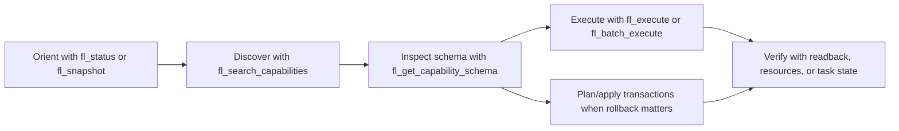

# fl-mcp

<!-- BADGES:START -->
<!-- markdownlint-disable MD013 MD033 -->
<!-- generated by add-badges 2026-06-13 -->
<p align="center">
  <a href="https://github.com/wyattowalsh/fl-mcp/actions"></a>
  <a href="https://github.com/wyattowalsh/fl-mcp/commits/main"></a>
  <a href="https://github.com/wyattowalsh/fl-mcp/blob/main/LICENSE"></a>
  <a href="docs/content/docs/index.mdx"></a>
</p>

<p align="center">
  <a href="https://www.python.org/"></a>
  <a href="https://gofastmcp.com/"></a>
  <a href="https://modelcontextprotocol.io/"></a>
  <a href="https://www.image-line.com/fl-studio/"></a>
  <a href="https://docs.astral.sh/uv/"></a>
  <a href="https://just.systems/"></a>
</p>

<p align="center">
  <a href="https://docs.astral.sh/ruff/"></a>
  <a href="https://docs.astral.sh/ty/"></a>
  <a href="https://docs.pytest.org/"></a>
  <a href="https://coverage.readthedocs.io/"></a>
  <a href="https://pre-commit.com/"></a>
</p>

<p align="center">
  <a href="https://github.com/wyattowalsh/fl-mcp/stargazers"></a>
  <a href="https://github.com/wyattowalsh/fl-mcp/issues"></a>
  <a href="https://github.com/wyattowalsh/fl-mcp/pulls"></a>
  <a href="https://github.com/wyattowalsh/fl-mcp/graphs/contributors"></a>
</p>

<!-- markdownlint-enable MD013 MD033 -->
<!-- BADGES:END -->

> [!IMPORTANT]
> `fl-mcp` is an agent-first FastMCP server for FL Studio. It exposes a compact
> public tool surface while keeping the full DAW operation catalog behind typed
> discovery, schema, execution, resource, and prompt workflows.

<!-- markdownlint-disable MD013 -->

## Start Here

| Icon | Need | Path |
| --- | --- | --- |
| ![Terminal][icon-terminal] | Install or run the server | [Quick start](#quick-start) |
| ![Workflow][icon-workflow] | Understand the control flow | [Agent control loop](#agent-control-loop) |
| ![Layers][icon-layers] | Inspect public tools | [Compact surface](#compact-surface) |
| ![Plug][icon-plug] | Connect real FL Studio | [Live FL Studio bridge](#live-fl-studio-bridge) |
| ![Folder tree][icon-folder-tree] | Work in the repo | [Development deck](#development-deck) |
| ![Book][icon-book-open] | Read deeper docs | [Documentation](#documentation) |

## At A Glance

| Icon | Surface | Current shape |
| --- | --- | --- |
| ![Layers][icon-layers] | Visible MCP tools | 12 compact FastMCP tools |
| ![Activity][icon-activity] | Internal operations | 216 typed FL Studio operations |
| ![Music][icon-music] | FL Studio domains | 16 domains |
| ![Book][icon-book-open] | Read model | 5 resources, 3 templates, 8 prompts |
| ![Terminal][icon-terminal] | Default mode | Deterministic mock catalog (216 ops) |
| ![Plug][icon-plug] | Live mode | 8 verified + 208 attemptable on bundled bridge |
| ![Shield][icon-shield-check] | Providers | `mock`, `flapi-live`, `piano-roll-script`, `midi-fallback` |
| ![uv][icon-uv] | Package manager | `uv` |
| ![Book][icon-book-open] | Docs app | Nested Fumadocs + Next.js package |

Mock mode covers the complete **216-operation** internal catalog for local and
CI validation. In live mode, `provider="auto"` resolves to `flapi-live` for
every catalog operation and does **not** silently fall back to mock.

> [!IMPORTANT]
> **Verified vs attemptable live coverage**
>
> - **Verified live (8 ops):** `general.get_version`, `general.get_project_title`,
>   `transport.get_tempo`, `transport.get_state`, `transport.set_tempo`,
>   `transport.play`, `transport.pause`, `transport.stop`.
> - **Attemptable live (208 ops):** remaining catalog operations that may return
>   structured `api_missing`, `unsupported_host_behavior`, `path_unavailable`, or
>   `host_exception` results when FL Studio does not expose a compatible callable.
>
> The public surface also includes **8 workflow prompts** and **4 providers**.
> See [Tier B release runbook](docs/content/docs/validation/tier-b-release.mdx)
> for operator gates.

## Agent Control Loop



Primitive operation ids such as `mixer.set_track_volume` stay behind the
compact executor tools. They are not visible MCP tools.

## Compact Surface

| Icon | Tool | Role |
| --- | --- | --- |
| ![Activity][icon-activity] | `fl_status` | Runtime, provider, bridge, task, and catalog health. |
| ![Dashboard][icon-dashboard] | `fl_snapshot` | Project, session, and domain state read path. |
| ![Search][icon-search] | `fl_search_capabilities` | Find operations by intent, domain, and safety. |
| ![JSON][icon-file-json] | `fl_get_capability_schema` | Fetch exact payload and result contracts. |
| ![Play][icon-play] | `fl_execute` | Run one typed internal operation by id. |
| ![Layers][icon-layers] | `fl_batch_execute` | Run ordered batches with readback policy. |
| ![Workflow][icon-workflow] | `fl_plan` | Preview transaction-envelope changes. |
| ![Shield][icon-shield-check] | `fl_apply` | Apply rollback-aware transaction envelopes. |
| ![Music][icon-music] | `fl_render` | Start render/export tasks. |
| ![Activity][icon-activity] | `fl_analyze_audio` | Start audio-analysis tasks. |
| ![Plug][icon-plug] | `fl_manage_providers` | Inspect and manage provider routing. |
| ![Folder tree][icon-folder-tree] | `fl_browser` | Work with plugins, presets, samples, and assets. |

## Quick Start

For a published package:

```bash
uvx fl-mcp --version
uvx fl-mcp server run --mode stdio --dry-run
uvx fl-mcp doctor --format json
uvx fl-mcp install --dry-run
```

For this checkout before publication:

```bash
uvx \
  --from /absolute/path/to/fl-mcp \
  --with-editable /absolute/path/to/fl-mcp \
  fl-mcp server run --mode stdio --dry-run
```

Use this MCP stdio command after publication:

```json
{
  "command": "uvx",
  "args": ["fl-mcp", "server", "run", "--mode", "stdio"]
}
```

Use this shape for local source testing:

```json
{
  "command": "uvx",
  "args": [
    "--from",
    "/absolute/path/to/fl-mcp",
    "--with-editable",
    "/absolute/path/to/fl-mcp",
    "fl-mcp",
    "server",
    "run",
    "--mode",
    "stdio"
  ]
}
```

## Live FL Studio Bridge

`fl-mcp install --dry-run` prints bridge commands and environment blocks for
live mode. Prefer the reported `uvx_environment` block for MCP clients because
it avoids depending on uv cache interpreter paths.

Published host bridge command:

```bash
uvx --from fl-mcp python -m fl_mcp.bridge.host_client
```

Source checkout bridge command:

```bash
uvx \
  --from /absolute/path/to/fl-mcp \
  --with-editable /absolute/path/to/fl-mcp \
  python -m fl_mcp.bridge.host_client
```

Install the bundled controller script from:

```text
fl-bundle/controller/device_FL_MCP_Bridge.py
```

Copy it into the reported FL Studio `Settings/Hardware/FL MCP Bridge/`
directory, then select `FL MCP Bridge` in FL Studio MIDI settings. Use the
installer-reported `FL_MCP_FL_STUDIO_BRIDGE_DIR`; on normal macOS installs this
is the script-local `Settings/Hardware/FL MCP Bridge/bridge` directory and must
remain private to the current user.

## Repository Map

| Icon | Path | Contents |
| --- | --- | --- |
| ![Terminal][icon-terminal] | `src/fl_mcp/` | Runtime, tools, resources, providers, bridge, CLI. |
| ![Book][icon-book-open] | `docs/` | Fumadocs app, generated references, and content. |
| ![Music][icon-music] | `fl-bundle/` | FL Studio controller and DAW-side bridge files. |
| ![Activity][icon-activity] | `helper/` | Thin macOS diagnostics helper scaffold. |
| ![Workflow][icon-workflow] | `skills/` | Repo-local agent skills for FL MCP workflows. |
| ![Workflow][icon-workflow] | `goals/` | Goal packages, audits, and validation notes. |
| ![Shield][icon-shield-check] | `tests/` | Contract, unit, integration, benchmark, and smoke coverage. |

The JavaScript/TypeScript docs package is intentionally nested under `docs/`.
`docs/pnpm-lock.yaml` is the pnpm lockfile. Do not recreate root docs aliases
such as `package.json`, `pnpm-lock.yaml`, `pnpm-workspace.yaml`, or `Makefile`.

## Development Deck

Runtime commands:

```bash
uv sync --all-extras --dev --locked
just ci
uv run fl-mcp server run --mode stdio --dry-run
uv run fl-mcp doctor --format json
uv run fl-mcp install --dry-run
uv run pytest
```

Docs commands should run from the repository root with `--ignore-workspace` so
pnpm does not climb into any parent workspace:

```bash
pnpm --dir docs --ignore-workspace install --frozen-lockfile
pnpm --dir docs --ignore-workspace docs:generate-reference
pnpm --dir docs --ignore-workspace lint
pnpm --dir docs --ignore-workspace check
pnpm --dir docs --ignore-workspace build
pnpm --dir docs --ignore-workspace dev
```

Skill package checks:

```bash
python3 skills/fl-mcp-production-flow/scripts/setup-check.py --mode mock --source local --repo-root . --format json
python3 -m json.tool skills/fl-mcp-production-flow/evals/evals.json >/dev/null
npx skills add . --skill fl-mcp-production-flow --list
```

Use the configured `skill-creator` audit for full skill quality scoring. If a
centralized `wagents` harness also needs reconciliation, run `wagents` with an
explicit agents repository root instead of auto-discovering this checkout.

## Governance

- Public MCP surface changes must update the
  [public API inventory](docs/content/docs/architecture/public-api-inventory.mdx).
- Generated references under `docs/content/docs/reference/generated/` must be
  regenerated with `docs/scripts/generate-reference.mjs`.
- Live bridge behavior changes must update the
  [bridge protocol](docs/content/docs/architecture/bridge-protocol.mdx) and the
  relevant `fl-bundle/` README.
- Agent-skill changes under `skills/` must keep the skill package, evals,
  README, release notes, and docs guidance aligned. Installable skills should be
  previewed with `npx skills add . --skill <name> --list`.
- Release-facing behavior changes should be recorded in
  [release notes](docs/content/docs/release-notes.mdx) and, for larger
  workstreams, the relevant `goals/` package.
- GitHub release changelogs are generated from `.github/release.yml`; preview
  them with the **Changelog Preview** workflow before publishing a release.
- Nested `AGENTS.md` files define local behavior for `docs/`, `src/`,
  `fl-bundle/`, and `helper/`.

## Documentation

| Icon | Page | Focus |
| --- | --- | --- |
| ![Book][icon-book-open] | [Docs home](docs/content/docs/index.mdx) | Project overview. |
| ![Terminal][icon-terminal] | [Getting started](docs/content/docs/getting-started.mdx) | First run. |
| ![Plug][icon-plug] | [Installation](docs/content/docs/installation.mdx) | Client setup. |
| ![Layers][icon-layers] | [Concepts](docs/content/docs/concepts.mdx) | Surface model. |
| ![Workflow][icon-workflow] | [Operation workflows](docs/content/docs/operation-workflows.mdx) | Recipes. |
| ![Shield][icon-shield-check] | [Public API](docs/content/docs/architecture/public-api-inventory.mdx) | Contract. |
| ![Music][icon-music] | [Bridge protocol](docs/content/docs/architecture/bridge-protocol.mdx) | Live bridge. |
| ![Activity][icon-activity] | [Validation runbook](docs/content/docs/validation-runbook.mdx) | Evidence. |
| ![Play][icon-play] | [Live FL Studio smoke](docs/content/docs/live-fl-studio-smoke.mdx) | Manual app check. |
| ![Activity][icon-activity] | [Troubleshooting](docs/content/docs/troubleshooting.mdx) | Recovery. |

<!-- markdownlint-enable MD013 -->

## License

[MIT](LICENSE)

<!-- ICON-REFS:START -->
<!-- markdownlint-disable MD013 -->
[icon-activity]: https://api.iconify.design/lucide:activity.svg?width=18&height=18&color=%2310b981
[icon-book-open]: https://api.iconify.design/lucide:book-open.svg?width=18&height=18&color=%238b5cf6
[icon-dashboard]: https://api.iconify.design/lucide:layout-dashboard.svg?width=18&height=18&color=%232563eb
[icon-file-json]: https://api.iconify.design/lucide:file-json.svg?width=18&height=18&color=%23f59e0b
[icon-folder-tree]: https://api.iconify.design/lucide:folder-tree.svg?width=18&height=18&color=%236b7280
[icon-layers]: https://api.iconify.design/lucide:layers.svg?width=18&height=18&color=%238b5cf6
[icon-music]: https://api.iconify.design/lucide:music-4.svg?width=18&height=18&color=%23f37021
[icon-play]: https://api.iconify.design/lucide:play.svg?width=18&height=18&color=%2310b981
[icon-plug]: https://api.iconify.design/lucide:plug-zap.svg?width=18&height=18&color=%23f37021
[icon-search]: https://api.iconify.design/lucide:search.svg?width=18&height=18&color=%232563eb
[icon-shield-check]: https://api.iconify.design/lucide:shield-check.svg?width=18&height=18&color=%2310b981
[icon-terminal]: https://api.iconify.design/lucide:terminal.svg?width=18&height=18&color=%23111827
[icon-uv]: https://api.iconify.design/simple-icons:uv.svg?width=18&height=18&color=%235A67D8
[icon-workflow]: https://api.iconify.design/lucide:workflow.svg?width=18&height=18&color=%238b5cf6
<!-- markdownlint-enable MD013 -->
<!-- ICON-REFS:END -->
